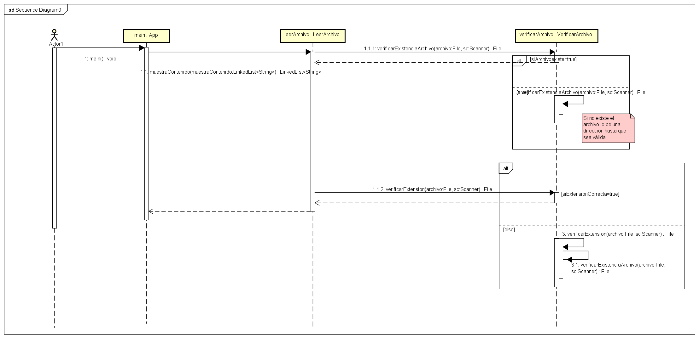
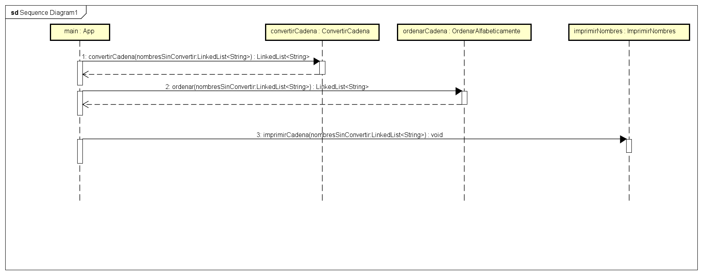

# Formateo de Nombres Txt

## Explicación
Programa que lee un txt, las ordena alfabeticamente y les da formato

### Ejemplo
Sin formato

VicToR HUGO
jOrGE HErrera
arIEL ferNadez
wiLbERTH gAmBoA

Con formato:
Ariel Fernadez
Jorge Herrera 
Victor Hugo
Wilberth Gamboa
## ¿Cómo usarlo?
El programa requiere de escribir la ruta completa en donde se encuentra alojado el archivo el cual debe terminar en .txt
Ejemplo:
C:\Users\wwil\Desktop\FormateoNombresTxt\nombres.txt
## Implementación
En caso de no encontrar la ruta el programa manda un aviso al usario
En caso de que la extensión no sea la correcta manda un aviso al usuario

## Diagrama de clase
 </img> 
## Diagramas de secuencia
 </img> 
 </img> 